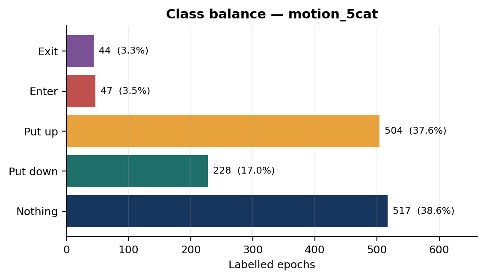
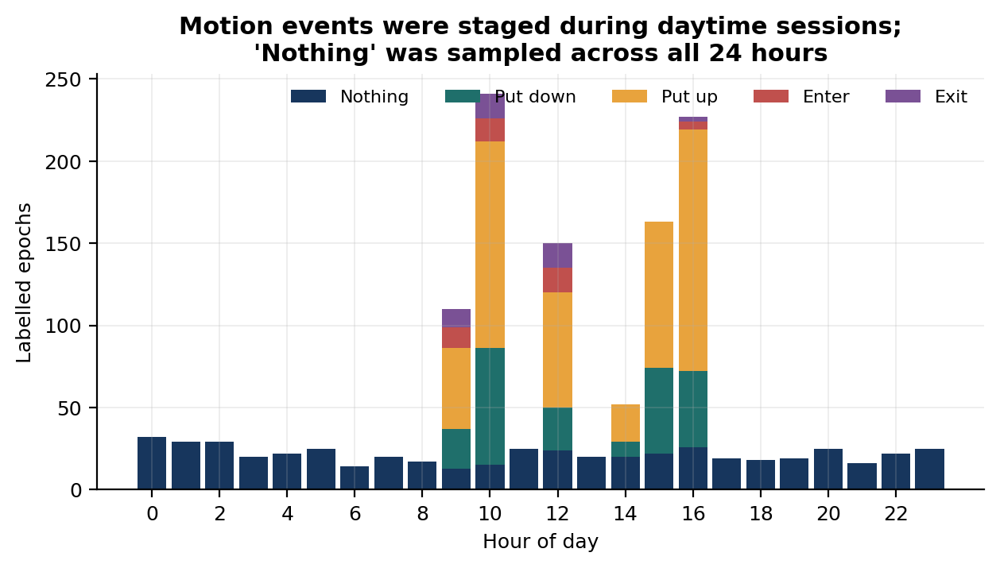
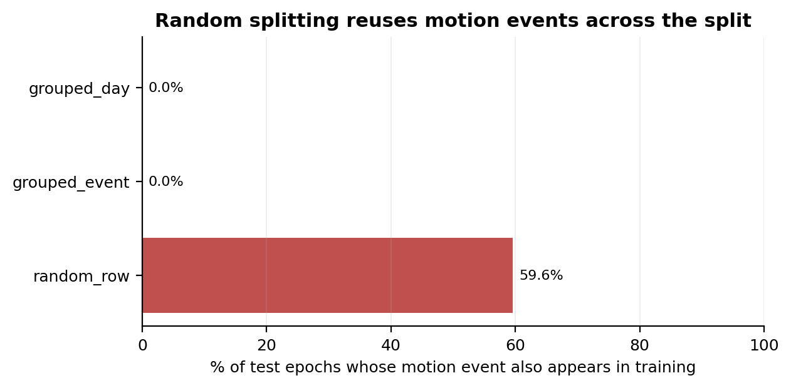
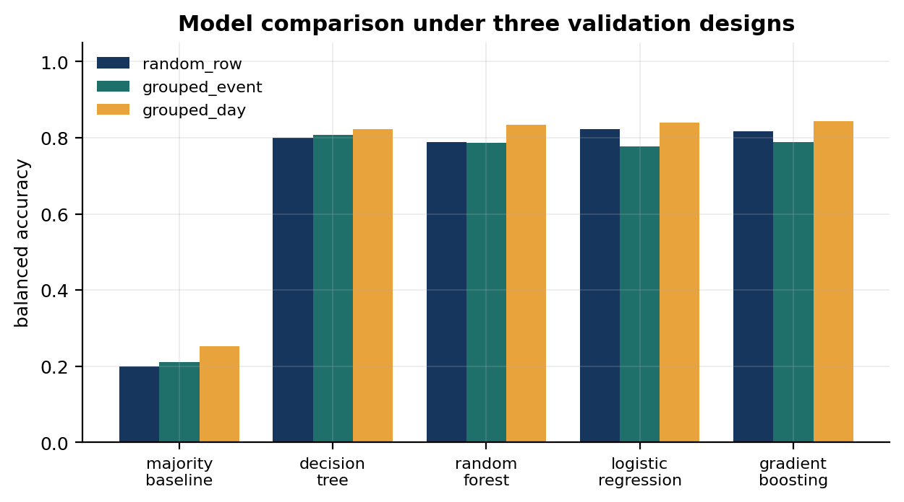
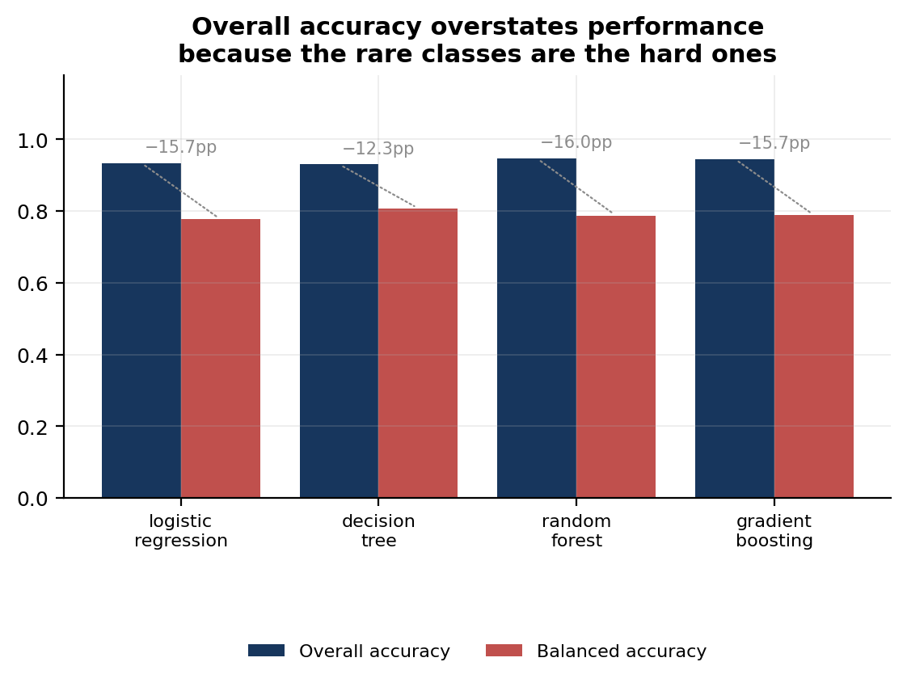
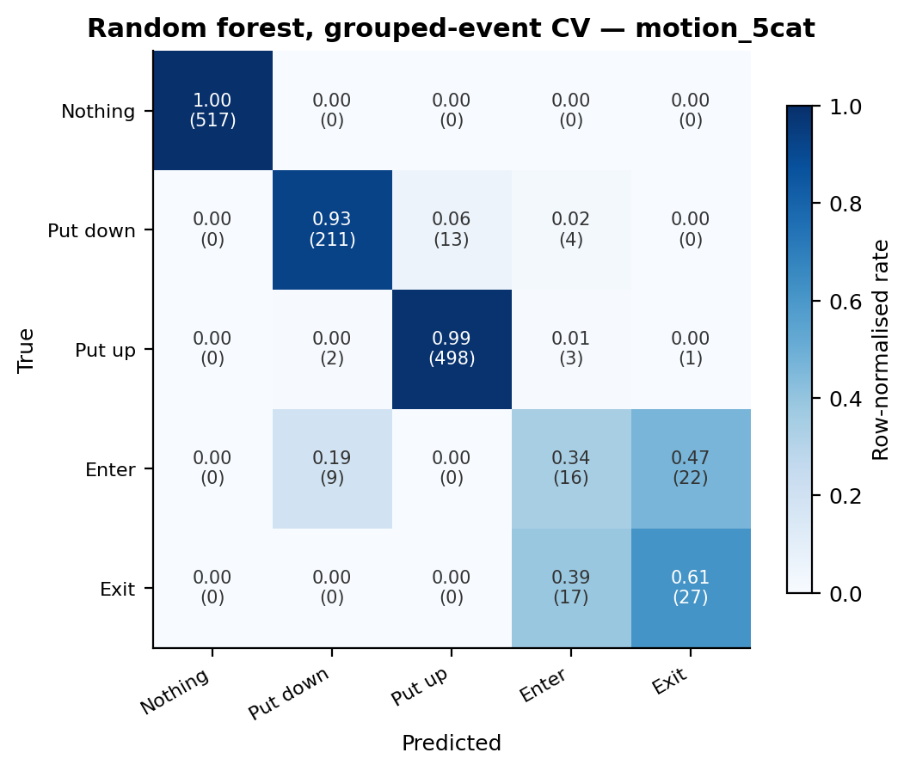
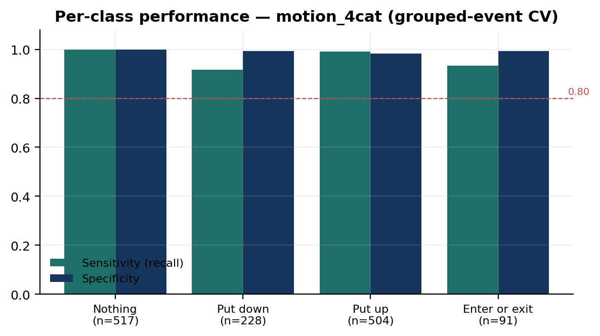
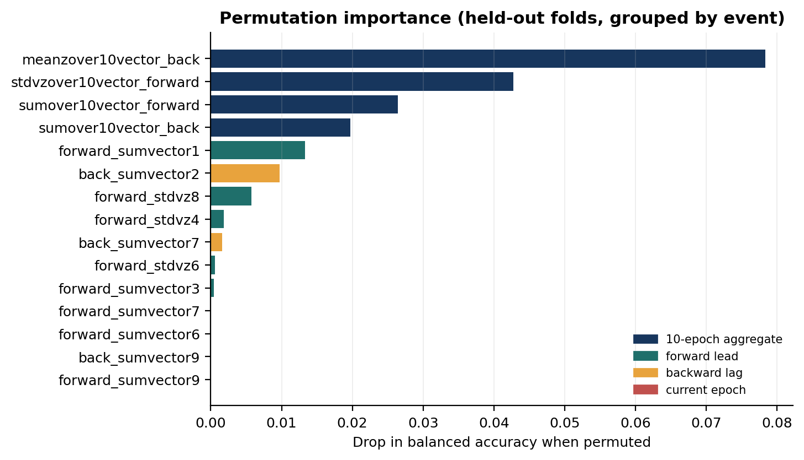

# Machine Learning for Bed-Net Use Behaviour Detection from Accelerometer Data

**Classifying how long-lasting insecticidal nets are actually used, from a single accelerometer fixed to the net.**

An end-to-end, reproducible machine-learning pipeline over 1,340 human-tagged epochs of tri-axial accelerometer data from a bed-net monitoring study. The project takes the data from a raw Stata extract through validation, leakage-aware experimental design, model comparison, interpretation and a demonstration application.

> **The headline result is a negative one.** The model reaches 94.7% overall accuracy on the five-behaviour task — and that number is misleading. Balanced accuracy is 78.7%, because the two behaviours that matter most for malaria exposure, *entering* and *exiting* a net, are classified at sensitivities of 0.34 and 0.61. This repository is built around measuring, explaining and reporting that gap rather than hiding it behind the headline figure.

---

## Contents

- [Public-health context](#public-health-context)
- [Research question](#research-question)
- [Dataset](#dataset)
- [Data pipeline](#data-pipeline)
- [Experimental design: avoiding leakage](#experimental-design-avoiding-leakage)
- [Results](#results)
- [Interpretability](#interpretability)
- [Model governance: registry, drift, promotion, rollback](#model-governance-registry-drift-monitoring-promotion-and-rollback)
- [DHIS2 data-entry anomaly detection](#dhis2-data-entry-anomaly-detection)
- [Limitations](#limitations)
- [What I would do next](#what-i-would-do-next)
- [Reproducing this work](#reproducing-this-work)
- [Project architecture](#project-architecture)
- [Data governance](#data-governance)

---

## Public-health context

Insecticide-treated bed nets are one of the main tools of malaria control, and net distribution is measured carefully. How nets are *used* is measured far less well. The standard instrument is a household survey question — "did you sleep under a net last night?" — which yields a single self-reported point estimate and is subject to recall and social-desirability bias.

What that misses is everything temporal: how much of the night a person is actually under the net, when they enter and leave, whether the net is unfurled at dusk or at midnight, and how any of this shifts across seasons. Those gaps matter because mosquito biting is concentrated in particular hours; a net that is up but entered late leaves real exposure unmeasured.

An accelerometer fixed to the net offers an objective, continuous alternative — provided the movement signal can be turned into behaviour reliably. That is the machine-learning problem this project addresses.

**Prior work.** The methodology follows Koudou et al. (2022), *Evaluation of an accelerometer-based monitor for detecting bed net use and human entry/exit using a machine learning algorithm*, Malaria Journal 21:85. That study, conducted under controlled conditions in Liverpool in 2018, reported 96.2% accuracy for a three-category model, 94.8% for four categories and 82.9% for five, with entry/exit sensitivity of 0.681 and 0.632 and significantly worse performance for children than adults.

**This project analyses a different, later tagged dataset** (September–October 2021, 1,340 epochs, a richer 48-feature representation). It is not a re-analysis of the published data and its numbers are not directly comparable. What it does is test whether the published *limitation* reappears independently. It does.

---

## Research question

> Can bed-net use behaviours be classified from accelerometer-derived movement features, and — critically — **which behaviours can be classified reliably enough to be used programmatically?**

The second clause is the whole point. A model that detects whether a net is up or down, but cannot tell entering from exiting, supports some public-health uses and not others. Establishing which is which is more useful than maximising a single accuracy score.

---

## Dataset

| Property | Value |
|---|---|
| Labelled epochs | 1,340 |
| Contiguous motion events | 664 |
| Recording days | 25 |
| Period | 10 September – 4 October 2021 |
| Features | 48 |
| Missing values | 0 |
| Duplicate feature vectors | 0 |

Each row is one human-tagged second of accelerometer data, described by:

- **Current epoch** — sum of vector magnitudes, standard deviation of the z axis
- **Backward lags** — the same two statistics for each of the 10 preceding seconds
- **Forward leads** — the same for the 10 following seconds
- **Window aggregates** — sums, means and standard deviations across those 10-epoch windows

So every observation carries a **21-second context window** centred on the tagged second.

### Label schemes

Four nested schemes, from coarsest to finest. Their mutual consistency is asserted at load time.

| Scheme | Classes | Support |
|---|---|---|
| `motion_something` | Nothing / Something | 517 / 823 |
| `motion_3cat` | Nothing / Down event / Put up | 517 / 319 / 504 |
| `motion_4cat` | Nothing / Put down / Put up / **Enter or exit** | 517 / 228 / 504 / **91** |
| `motion_5cat` | Nothing / Put down / Put up / **Enter** / **Exit** | 517 / 228 / 504 / **47** / **44** |

The class imbalance is the crux: the operationally interesting behaviours are the rarest, at 3.5% and 3.3% of the data.



Motion events were staged during daytime sessions, while "Nothing" was sampled across all 24 hours:



---

## Data pipeline

Eight automated checks run on every execution; a `fail` blocks modelling.

| Check | Result on this extract |
|---|---|
| Required columns | 53 of 53 present |
| Missing values | None |
| Duplicate feature rows | None |
| Timestamp validity | All 1,340 parse and are unique |
| Label consistency | Nested schemes mutually consistent |
| Value ranges | All within plausible bounds |
| Class support | Rarest class 91 epochs (`motion_4cat`) — flagged |
| Event purity | All 664 events label-pure |

Reproduce with `PYTHONPATH=src python scripts/run_pipeline.py --stage quality`.

The pipeline is staged and resumable (`quality → sweep → interpret → manifest`), so an expensive sweep does not have to be repeated to regenerate a report.

---

## Experimental design: avoiding leakage

This is the part of the project I would most want a reviewer to read.

Each labelled motion is recorded as a **contiguous run of 1-second epochs** — up to 16 seconds long — and every row carries features describing the 10 seconds before and after it. Two adjacent rows from the same event therefore overlap in roughly 90% of their input signal. They are near-duplicates.

Splitting those rows at random puts near-duplicate windows on both sides of the split. Measured on this dataset:

> **Under a random split, 59.6% of test epochs come from a motion event that also appears in the training set.**



So three validation designs are compared throughout:

| Strategy | Grouping | Question it answers |
|---|---|---|
| `random_row` | none | *(the naive approach)* |
| `grouped_event` | `event_id` | How well does this work on an unseen motion event? |
| `grouped_day` | `session_date` | How well does this work on an unseen recording session? |

### The result was not what I expected

| Model | Random | Grouped (event) | Grouped (day) | Inflation |
|---|---|---|---|---|
| Logistic regression | 0.9373 | 0.9343 | 0.9099 | +0.003 |
| Decision tree | 0.9373 | 0.9306 | 0.9024 | +0.007 |
| Random forest | 0.9522 | 0.9470 | 0.9419 | +0.005 |
| Gradient boosting | 0.9552 | 0.9455 | 0.9441 | +0.010 |

*Five-category task, 5-fold CV, overall accuracy.*

**Leakage inflates accuracy by only 0.3 to 1.0 percentage points.** The structural risk is real and measurable — 59.6% of test epochs share an event with training — but on this dataset it does not materially change the score. Reporting that honestly matters more than the tidier story I set out to tell: the classes are separated by broad signal-energy differences that generalise across events and days, not by event-specific quirks.

The design is still the right one. The diagnostic is cheap, the risk was genuine, and on a dataset where events were longer or classes subtler the answer could easily have gone the other way. **Grouped-event CV is used for every result below.**

---

## Results

### Model comparison



All four real models beat the majority baseline by a wide margin, and they land within about 1.5 points of each other. **A logistic regression on 48 engineered features reaches 0.934 accuracy against the random forest's 0.947** — the ensemble buys roughly one point. Given that, the simpler model is genuinely competitive, and on a project where a Ministry of Health team has to maintain the result, that matters.

Deep learning was considered and rejected. With 664 independent events and 91 minority-class examples, a 1D CNN or LSTM cannot be trained or validated credibly here. Building one would demonstrate familiarity with the API and nothing about the science.

### The honest headline



| Metric | Five-category | Four-category |
|---|---|---|
| Overall accuracy | 0.947 | 0.978 |
| Balanced accuracy | 0.787 | 0.965 |
| Macro F1 | 0.751 | 0.956 |
| Macro ROC-AUC | 0.989 | 0.998 |

*Random forest, grouped-event CV.*

Overall accuracy overstates five-category performance by **16 percentage points** relative to balanced accuracy. Note also how high macro AUC stays (0.989) while macro F1 sits at 0.751 — the model ranks classes well but its decision threshold places rare classes badly. Reporting AUC alone would have concealed this.

### Where it fails



| Behaviour | Support | Sensitivity | Specificity | F1 |
|---|---|---|---|---|
| Nothing | 517 | **1.000** | 1.000 | 1.000 |
| Put down | 228 | **0.925** | 0.990 | 0.938 |
| Put up | 504 | **0.988** | 0.984 | 0.981 |
| Enter | 47 | **0.340** | 0.981 | 0.368 |
| Exit | 44 | **0.614** | 0.982 | 0.574 |

**Entering and exiting are confused with each other.** Of 31 misclassified *Enter* epochs, 22 are predicted as *Exit*; of 17 misclassified *Exit* epochs, all 17 are predicted as *Enter*. Entry/exit confusion accounts for 39 of the 56 errors on those two classes.

This independently reproduces the published limitation. Koudou et al. reported that entering and exiting "were most commonly confused with each other, representing 83.3% and 85.7% of the classification errors". The same failure appears here, on different data, three years later, with a richer feature set.

That convergence is the most scientifically meaningful thing in this repository. It suggests the limitation is **not** an artefact of one dataset or one feature choice, but something closer to a physical limit: a single accelerometer on the side panel of a net registers a similar disturbance whether a body is moving in or out. Direction is largely absent from the signal.

### Collapsing the classes fixes it



| Behaviour | Support | Sensitivity | Specificity | F1 |
|---|---|---|---|---|
| Nothing | 517 | 1.000 | 1.000 | 1.000 |
| Put down | 228 | 0.917 | 0.994 | 0.941 |
| Put up | 504 | 0.990 | 0.982 | 0.980 |
| Enter **or** exit | 91 | **0.934** | 0.994 | 0.924 |

Merging entry and exit into a single "net was crossed" class lifts sensitivity on that behaviour from 0.34/0.61 to **0.934**, and balanced accuracy from 0.787 to 0.965.

**The four-category model is the recommended operating point.** It supports counting net crossings and detecting when a net goes up or down — which is enough for measuring net-use duration and timing. It does not support directional inference, and should not be used for it.

---

## Interpretability



Permutation importance on held-out folds, scored by balanced accuracy:

| Feature | Block | Importance |
|---|---|---|
| `meanzover10vector_back` | 10-epoch aggregate | 0.078 |
| `stdvzover10vector_forward` | 10-epoch aggregate | 0.043 |
| `sumover10vector_forward` | 10-epoch aggregate | 0.026 |
| `sumover10vector_back` | 10-epoch aggregate | 0.020 |
| `forward_sumvector1` | forward lead | 0.013 |

**The four window-level aggregates dominate; the twenty individual per-second lag features contribute almost nothing.** Mean z-axis displacement over the preceding 10 seconds is the single most informative feature by a factor of nearly two.

This aligns with the published importance analysis, which found the top variables were averages over a single dimension across the two 10-second periods. Both point the same way: **the discriminating information is the aggregate orientation change of the net over a window, not the fine structure within it.** A net being raised or lowered produces a sustained displacement; a body crossing the threshold produces a burst. Those are separable. Direction of crossing is not.

### The ablation confirms it

Each feature block was evaluated under identical grouped-event CV:

| Feature block | Features | Accuracy | Balanced accuracy | Macro F1 |
|---|---|---|---|---|
| Current epoch + window aggregates | **8** | 0.9388 | **0.7968** | **0.7567** |
| All features | 48 | 0.9470 | 0.7874 | 0.7514 |
| Current epoch + backward lags only | 22 | 0.8418 | 0.5928 | 0.5595 |
| Current epoch only | 2 | 0.7037 | 0.4799 | 0.4545 |

Two things follow.

**Eight features outperform all forty-eight on balanced accuracy.** The 40 individual per-second lag columns add nothing and marginally hurt — consistent with the permutation results, where permuting the lag blocks slightly *improved* held-out balanced accuracy. **The feature set can be cut by 83% with no loss**, which matters for on-device or low-bandwidth inference in field conditions.

**Forward context is essential.** Restricting the model to the current epoch and backward lags collapses balanced accuracy from 0.797 to 0.593. Knowing what happens *after* the tagged second is what distinguishes a net going up from a net going down. That has a real deployment consequence: this classifier is inherently retrospective and cannot run in true real time — it needs roughly 10 seconds of lookahead.

*Interpretation caveat.* These are associations between engineered signal features and a human-applied label. Permutation importance measures what a model relies on, not what causes a behaviour. Nothing here supports a causal claim.

---

## Limitations

Stated plainly, because they bound what the results mean.

1. **No participant identifier.** The extract contains no participant, device or net ID. Grouping is therefore by event and by recording day, not by person. **This project cannot estimate performance on a new participant** — the generalisation claim most relevant to deployment. This is the single biggest limitation.

2. **Cannot reproduce the adult/child bias analysis.** The published study found models significantly less accurate for children than adults (87.8% vs 70.0%). Without participant demographics, that subgroup analysis is impossible here. Given that children sleep under nets and are a priority malaria population, this is a material gap in what can be claimed about fairness.

3. **Entry/exit direction is not recoverable** from this sensor placement and feature set, at these sample sizes.

4. **Small minority classes.** 47 *Enter* and 44 *Exit* epochs, in 5-fold CV, means roughly 9 test examples per fold. Per-class estimates for those behaviours carry wide uncertainty.

5. **Staged conditions.** Motion events were recorded in daytime sessions, not during natural overnight net use. Real-world performance will differ.

6. **Single sensor placement.** One accelerometer on one side panel. Results say nothing about other placements.

7. **`Nothing` is classified perfectly (517/517), which is suspicious.** The most likely explanation is benign — those epochs are periods of near-zero movement, trivially separable from any motion. But perfect separation always deserves scrutiny, and with a participant ID I would check whether it reflects a recording-context artefact rather than the behaviour itself.

---

## Model governance: registry, drift monitoring, promotion and rollback

Validation answers "is this model good enough today". Deployment asks "who approved it, on what evidence, is it still good, and how do we undo it" — so `src/smartnet/mlops/` implements that lifecycle.

```
register → gate → staging → production → monitor → trigger → rollback
```

| Capability | Implementation |
|---|---|
| Versioned registry | Auto-incrementing versions, joblib artefacts, JSON index |
| Training-data lineage | SHA-256 hash of the exact training matrix per version |
| Controlled promotion | `registered → staging → production`; illegal transitions raise |
| Quality gates | Thresholds on **balanced accuracy and worst-class sensitivity** |
| Feature drift | Population Stability Index + Kolmogorov–Smirnov vs a reference profile |
| Prediction drift | Predicted-class PSI — works without ground truth |
| Retraining trigger | Explicit multi-signal policy, not a calendar |
| Rollback | Restores the last approved version in one call |
| Audit trail | Append-only JSONL: actor, reason, timestamp, stage change |

### The gate blocks this project's own model

Running the lifecycle, the five-category model is refused promotion:

```
BLOCKED — balanced_accuracy 0.774 < 0.90;
          worst_class_sensitivity 0.340 < 0.75;
          accuracy-balanced gap 0.173 > 0.10
          (headline metric is masking minority-class failure)
```

The gate is deliberately set on balanced accuracy and worst-class sensitivity rather than accuracy, because the central finding of this repository is that accuracy hides minority-class failure. **The scientific finding is encoded as an automated control.** The four-category model then passes on its merits; a later promotion is rolled back and the reason recorded.

Reproduce: `PYTHONPATH=src python scripts/run_mlops_lifecycle.py`

### Why not a calendar for retraining

Retraining on a fixed schedule wastes effort when nothing has changed and is far too slow when something has. The policy escalates instead: drift alone → *investigate*; drift **plus** confirmed performance loss → *retrain*. On a stable batch it returns `no_action` (worst PSI 0.025); on a simulated sensor recalibration it returns `retrain` with five stated reasons.

Because labels arrive late in health settings, feature and prediction drift are the early warning and performance is the confirmation.

---

## DHIS2 data-entry anomaly detection

`src/smartnet/dhis2/` addresses the other named DART use case, built against the DHIS2 aggregate data model (`dataElement / period / orgUnit / categoryOptionCombo`) so it runs on an `/api/dataValueSets` export unchanged.

**Design principle: precision over recall.** A district health officer sent fifty false flags a month stops opening the report — at which point the tool has made data quality worse. Every flag carries a confidence and a plain-language explanation, and the pipeline ranks rather than dumps.

Six detector families: impossible values · MAD outliers · cross-element consistency · level shift · digit preference · missing reports.

Median-absolute-deviation is used rather than standard deviation because a single mis-keyed extreme inflates the standard deviation enough to conceal itself — the classic failure of naive z-score screening on this data.

### Measured, not asserted

Evaluated on 5,700+ synthetic facility-months with **169 injected errors of known type**:

| Metric | Value |
|---|---|
| Precision @ top 10 / 25 / 50 / 100 | **1.000** |
| Overall precision / recall / F1 | 0.618 / 0.899 / 0.733 |
| Recall — impossible magnitude | 1.00 |
| Recall — extra digit | 0.98 |
| Recall — negative value | 0.97 |
| Recall — consistency break | 0.89 |
| Recall — **digit transposition** | **0.61** |

**Transposition is the honest weak spot.** Swapping two digits usually leaves the value inside the plausible range, so univariate detectors miss it. Catching it needs cross-element or historical-ratio reasoning — which is precisely where a model earns its place over rules, rather than being the starting point.

Reproduce: `PYTHONPATH=src python scripts/run_dhis2_anomaly.py`

### Verified against a live DHIS2 instance

`smartnet.dhis2.client` connects to the DHIS2 Web API and was validated against the **2.43.1 Sierra Leone demo** (1,209 data elements, 1,332 org units, 37 validation rules). Rather than hand-coding consistency checks, it **imports DHIS2's own validation rules** — parsing the `#{dataElementUid.categoryOptionComboUid}` expression grammar — so the detector inherits whatever the Ministry has configured. Compound expressions are skipped rather than approximated.

Run against real facility data (Bo district, 28 facilities, 12 months, 971 values), the detectors flagged 23 MAD outliers, the largest being an ANC 3rd-visit value of **1,935 against a facility median of 24.5** — the extra-digit signature, appearing unprompted in real data.

Notably, DHIS2's own `/api/outlierDetection` endpoint also defaults to modified z-score for the same reason we chose it: a single mis-keyed extreme inflates the standard deviation enough to conceal itself.

Full notes: [`docs/DHIS2_NOTES.md`](docs/DHIS2_NOTES.md). Credentials are read from `DHIS2_BASE_URL` / `DHIS2_USERNAME` / `DHIS2_PASSWORD`, never from code.

*Synthetic data is used because the public DHIS2 demo has no ground truth about which values are wrong, and real MOH data cannot be published. Injecting known errors is what makes precision and recall measurable at all.*

---

## What I would do next

In rough order of value:

1. **Obtain participant identifiers** and re-run every result with participant-level grouping. This is the only way to make a deployment-relevant generalisation claim, and it would enable the adult/child fairness analysis.
2. **Test a second sensor** or a second placement, to establish whether entry/exit direction is recoverable at all. This is a data-collection question, not a modelling one — no amount of model tuning will extract information the signal does not contain.
3. **Sequence models over raw epochs** once more labelled events exist. The current representation collapses each window to 48 summary statistics; a CNN over raw 10 Hz signal might capture the asymmetry that distinguishes entry from exit. This needs materially more data before it is worth attempting.
4. **Feature reduction** to the ~6 window aggregates that carry the signal, for low-power on-device inference.
5. **Calibration and abstention.** Rather than forcing a five-way decision, output "net crossed" with high confidence and abstain on direction — matching the model's actual capability to its output.
6. **Prospective validation** in real household conditions, which is where any programmatic claim has to be earned.

---

## Reproducing this work

```bash
git clone <repository-url>
cd smartnet-bednet-ml
python -m venv .venv && source .venv/bin/activate
pip install -r requirements.txt

# Without the study data — synthetic, schema-identical:
PYTHONPATH=src python scripts/make_synthetic_sample.py

# With the study extract at data/raw/tagged train data.dta:
PYTHONPATH=src python scripts/run_pipeline.py --label motion_5cat
PYTHONPATH=src python scripts/run_pipeline.py --label motion_4cat
PYTHONPATH=src python scripts/make_figures.py

# Model governance lifecycle and DHIS2 anomaly detection
PYTHONPATH=src python scripts/run_mlops_lifecycle.py
PYTHONPATH=src python scripts/run_dhis2_anomaly.py

# Or read the whole analysis as one notebook:
jupyter lab notebooks/SMARTNET_full_analysis.ipynb

# Tests (run entirely on synthetic fixtures — no study data needed)
PYTHONPATH=src pytest tests/ -q      # 86 passed

# Demonstration app
streamlit run app/streamlit_app.py
```

Determinism: every model, split and permutation is seeded from `config.RANDOM_SEED = 42`. All preprocessing sits inside `sklearn` pipelines so it is fitted within each CV fold, never across.

---

## Project architecture

```
smartnet-bednet-ml/
├── data/                      study data — git-ignored, see data/README.md
├── src/smartnet/
│   ├── config.py              paths, schema, feature blocks, split strategies
│   ├── data/
│   │   ├── loader.py          Stata loading, event/session derivation
│   │   └── validation.py      8 data-quality checks
│   ├── features/
│   ├── models/
│   │   ├── zoo.py             baseline → linear → tree → ensembles
│   │   ├── experiment.py      CV runner, sweep, leakage table
│   │   └── interpret.py       held-out permutation importance
│   ├── evaluation/
│   │   ├── splits.py          random / grouped-event / grouped-day + diagnostics
│   │   └── metrics.py         per-class sensitivity, specificity, balanced accuracy
│   └── visualization/plots.py 10 figure functions
├── notebooks/
│   ├── SMARTNET_full_analysis.ipynb   the whole analysis in one document
│   ├── 00_full_analysis.ipynb         condensed end-to-end run
│   └── 01–07                          themed chapters
├── scripts/
│   ├── run_pipeline.py        staged, resumable pipeline
│   ├── make_figures.py
│   ├── run_mlops_lifecycle.py governed lifecycle, end to end
│   ├── run_dhis2_anomaly.py   DHIS2 detection + evaluation
│   ├── make_notebooks.py
│   ├── merge_notebooks.py
│   └── make_synthetic_sample.py
├── tests/                     86 tests, synthetic fixtures
├── reports/figures/           14 generated figures
├── reports/model_results/     metrics, confusion matrices, manifests
└── app/streamlit_app.py       research demonstration
```

---

## Data governance

The tagged accelerometer extract is **human-subjects research data belonging to the study investigators**, not to this repository. It is excluded by `.gitignore` and is not distributed here. The full pipeline and test suite run without it.

Before this repository is made public, written permission from the study Principal Investigator is required — covering publication of derived results and figures, and naming the study. See [`data/README.md`](data/README.md).

---

## Citation

Koudou GB, Monroe A, Irish SR, Humes M, Krezanoski JD, Koenker H, Malone D, Hemingway J, Krezanoski PJ. *Evaluation of an accelerometer-based monitor for detecting bed net use and human entry/exit using a machine learning algorithm.* Malaria Journal. 2022;21:85. https://doi.org/10.1186/s12936-022-04102-z

---

## Author

**Ssemukuye Timothy** — MSc Data Science and Analytics, Uganda Christian University.
Data manager on the study that produced this dataset; this analysis is my own independent work on it.

*This is a research and portfolio project. It is not a medical device and has not been validated for clinical or programmatic use.*
